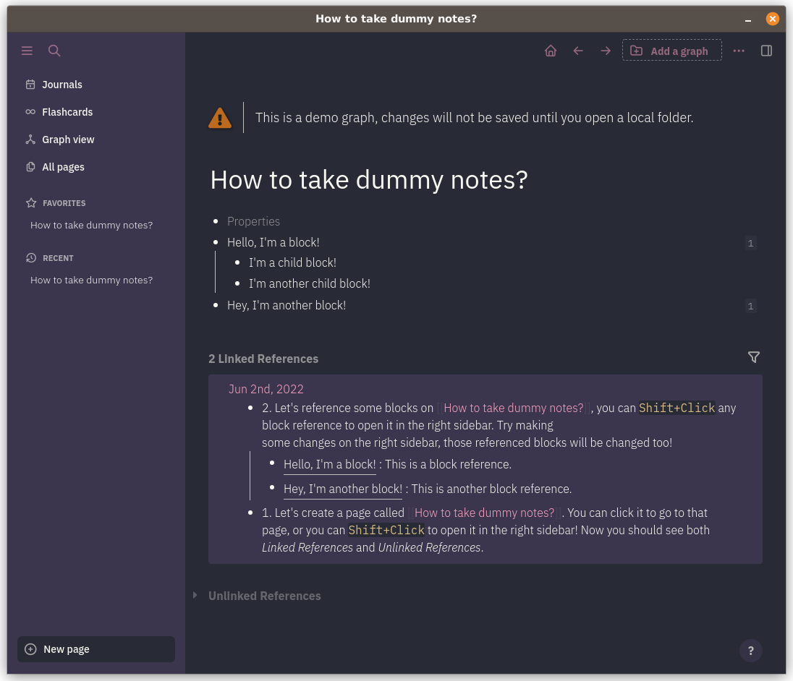

# Witch Hazel Theme for Logseq

> Witch Hazel is a dark, feminine color theme for various editors.

A [Witch Hazel](https://witchhazel.thea.codes) theme for [Logseq](https://logseq.github.io/).




## How to use it

Copy the content of `custom.css` into the `logseq/custom.css` file in your Logseq folder. Alternatively, copy this line
to `logseq/custom.css` to fetch and install the latest version automatically:

```css
@import url('https://cdn.jsdelivr.net/gh/zoeisnowooze/logseq-witchhazel@main/custom.css');
```

Make sure you are using the dark theme mode, as there isn't a light version of this theme.
